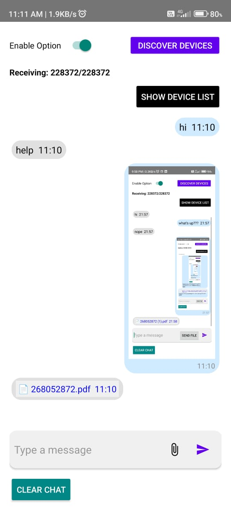
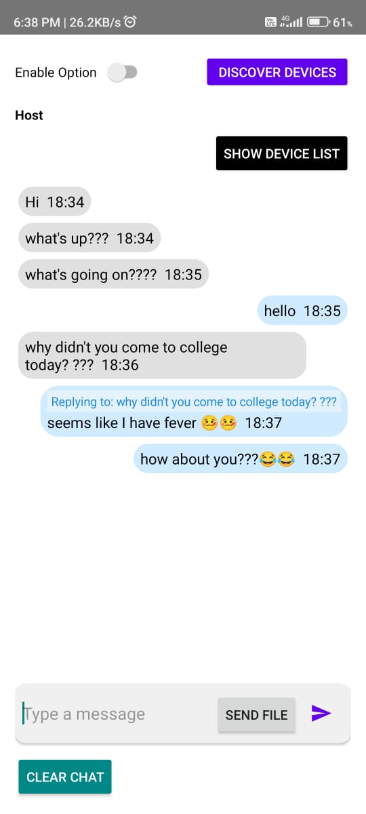
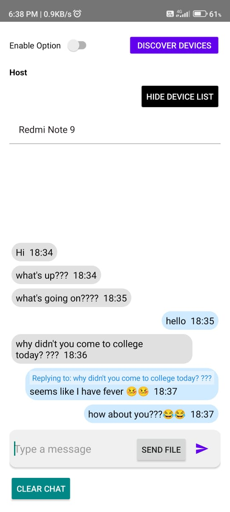
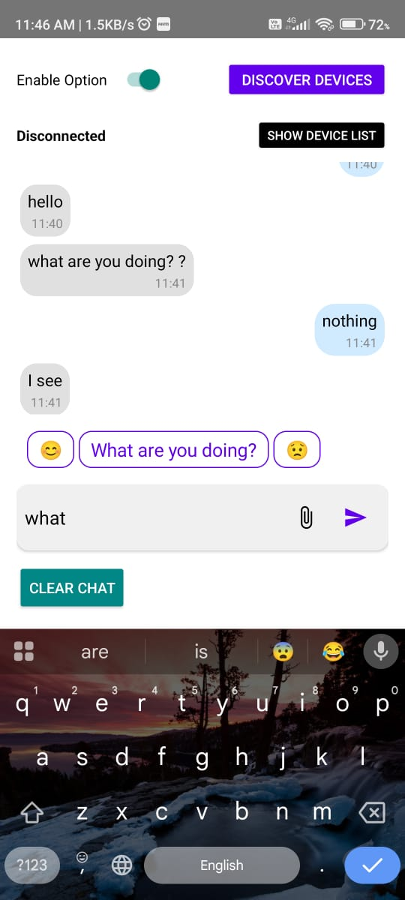

# Wi-Fi Direct Chat App

A simple Android chat app using **Wi-Fi Direct sockets** to enable peer-to-peer text messaging without an internet connection.

---
## 📦 Download APK

[⬇️ Click here to download the latest APK](https://github.com/user-attachments/files/20929066/WiFiDirectChat-v1.0.zip)

> 🔐 Extract the ZIP and install the `.apk` on your Android device.


## Features

- Peer-to-peer messaging over Wi-Fi Direct.
- real time voice-call 
- Real-time chat UI with sender/receiver message bubbles.
- Supports basic message and files sending and receiving with replying to specific message and timestamp .
- Deletion of messages and files
- AI integrated suggestions 

---

## Getting Started

### Prerequisites

- Android Studio (latest recommended)
- Android device or emulator with Wi-Fi Direct support
- Minimum SDK: 21 (Android 5.0 Lollipop)

---

### Installation

1. Clone the repository:

   ```bash
   git clone https://github.com/Krishna-Radharani/wifidirect-chat.git
   cd wifidirect-chat
2. Open the project in Android Studio.

3. Build and run on two devices not in emulators.
---

### Usage
1. Launch the app on two devices connected to the same Wi-Fi Direct group.

2. One device will act as host (server), the other as client.

3. Type messages in the input box and hit Send.

4. Messages will appear on both devices.

   ---
 
## Screenshot






---

## Required Permissions

This app requires the following permissions declared in your `AndroidManifest.xml`:

```xml
<uses-permission android:name="android.permission.INTERNET" />
<uses-permission android:name="android.permission.ACCESS_WIFI_STATE" />
<uses-permission android:name="android.permission.CHANGE_WIFI_STATE" />
<uses-permission android:name="android.permission.ACCESS_FINE_LOCATION" />


